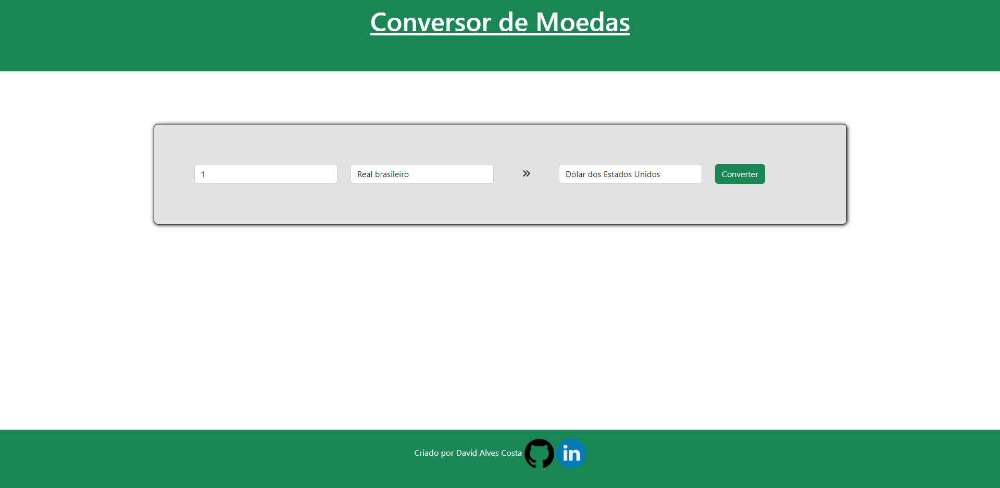
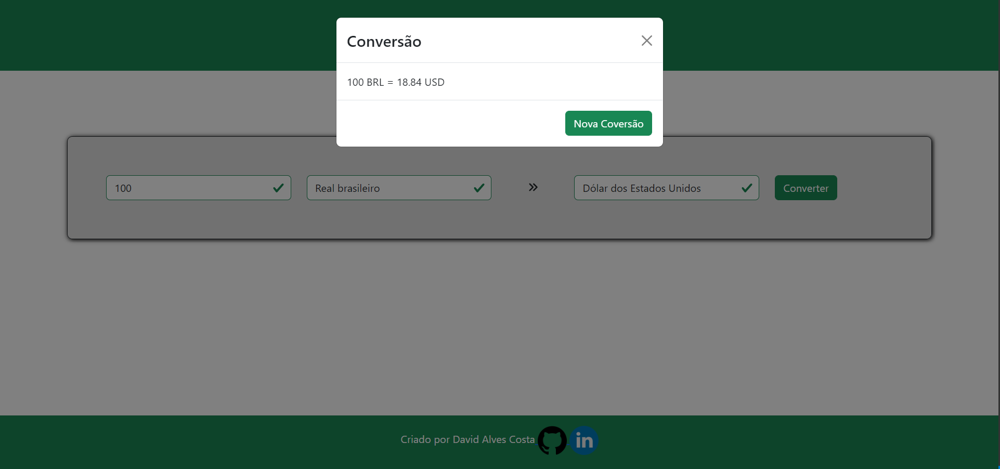
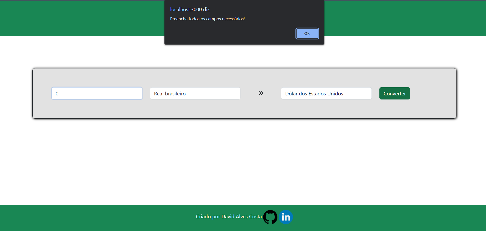
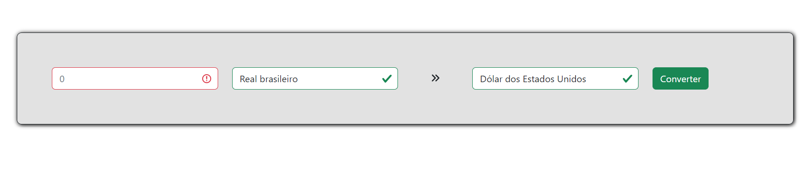

# Conversor-de-Moedas-React

### Projeto criado com tecnologias :
- Bootstrap;
- CSS;
- React Hooks;
- Axios;
- Requisições HTTP.


API utilizada ```Fixer.io```, fornecida no curso React Hooks , para utilizar as Moedas.

## Tela Inicial 
 

### Como utilizar:
- O primeiro campo , aceita somente números, coloque o valor que deseja converter;
- O segundo campo, receberá a primeira moeda para fazer a comparação, você por selecionar qual deseja , clicando no campo;
- O terceiro campo, receberá a segunda moeda para fazer a comparação,você por selecionar qual deseja , clicando no campo;
- O botão ```Converter``` fará a tarefa se todos os campos estiverem preenchidos;


### Utilizando o conversor:
- O Modal aparecerá com a conversão concluída. 
- Para fazer nova conversão basta clicar em ```Nova Conversão``` ou ``` 'X'```


### Caso o primeiro campo estiver sem valor:




### O intuito  do Projeto é aperfeiçoar tecnicas no Bootstrap. Utilizar o Axios para requisiçoes HTTP e fixar conteúdos React Hooks (useState)

### Obs: o conversor pode não estar atualizado com valor reais. Por favor confira  caso houver dúvidas sobre os valores fornecidos.
